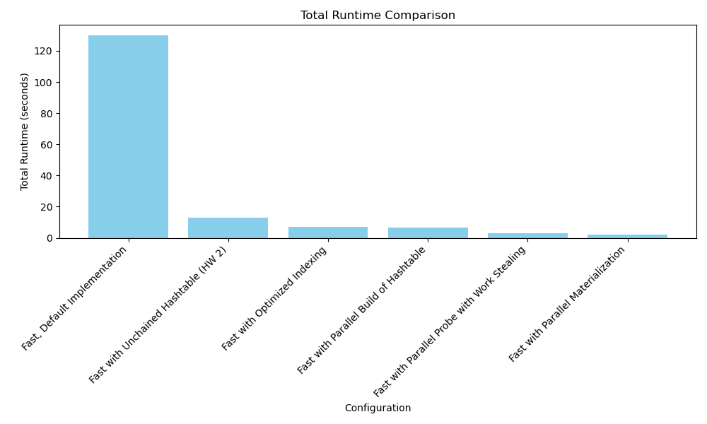

# Optimized Hash Join Pipeline

A high-performance hash join query execution engine achieving a **59x speedup** over the baseline implementation on the [Join Order Benchmark (JOB)](http://www.vldb.org/pvldb/vol9/p204-leis.pdf) using the IMDB dataset.



## Performance Summary

| Version | Implementation | Total Runtime | Speedup |
|---------|---------------|---------------|---------|
| v1.0.0 | Baseline (std::unordered_map) | 130.0s | 1.0x |
| v2.0.0 | Unchained Hash Table | 12.9s | 10.1x |
| v3.0.0 | + Optimized Indexing | 7.1s | 18.3x |
| v3.0.0 | + Parallel Build | 6.8s | 19.1x |
| v3.0.0 | + Parallel Probe (Work-Stealing) | 3.0s | 43.3x |
| v3.0.0 | + Thread Pool + mmap Allocator | 2.2s | **59.1x** |

> Benchmarked on Intel Xeon E5-2680 v3 (24 cores) running all 113 JOB queries (1a–33c).

## Key Optimizations

### Unchained Hash Table (v2.0.0)
Custom open-addressing hash table with Bloom filter tags for fast negative lookups. Eliminates pointer chasing from chained hashing, achieving 10x speedup through better cache locality and reduced branch mispredictions.

### Direct Page Access / Optimized Indexing (v3.0.0)
For non-null INT32 columns, bypasses data copying entirely by maintaining direct references to original column pages with pre-computed row-to-page mappings for O(1) access.

### Parallel Hash Table Build (v3.0.0)
Three-phase parallel construction (partition → count → insert) using a three-level slab allocator (mmap arena → bump allocator → per-partition storage) to eliminate memory allocation contention.

### Parallel Probe with Work-Stealing (v3.0.0)
Lock-free work-stealing via atomic counter for dynamic load balancing during the probe phase. Threads that finish early automatically pick up remaining work items.

### Reusable Thread Pool & mmap Allocator (v3.0.0)
Global thread pool with generation-based task dispatch eliminates ~1ms thread creation overhead per join. Lock-free mmap-based arena allocator reused across queries via `reset()`.

## Project Structure

```
├── include/
│   ├── unchained_ht.h       # Unchained hash table with Bloom filter tags
│   ├── utils.h              # ThreadPool, GlobalAllocator, column_t, buffer_t
│   ├── table.h              # Table representation
│   ├── plan.h               # Query plan parsing
│   ├── statement.h          # SQL statement types
│   └── ...
├── src/
│   ├── execute.cpp           # Core join execution (build, probe, materialize)
│   ├── build_table.cpp       # Table loading and column construction
│   ├── csv_parser.cpp        # CSV file parser
│   └── statement.cpp         # Statement handling
├── tests/
│   ├── unit_tests.cpp        # Unit tests for unchained hash table
│   ├── unchained_tests.cpp   # Hash table specific tests
│   ├── read_sql.cpp          # SQL query runner
│   └── build_database.cpp    # Database builder
├── job/                      # JOB benchmark SQL queries (1a–33c)
├── plans.json                # Pre-optimized query execution plans
├── Report.md                 # Detailed technical report with benchmarks
├── build.sh                  # Build script
├── run.sh                    # Run script
└── download_imdb.sh          # IMDB dataset downloader
```

## Getting Started

### Prerequisites
- C++17 compiler (GCC 9+ or Clang 10+)
- CMake 3.16+
- Linux (uses `mmap`, `<linux/version.h>`)

### Download the IMDB Dataset
```bash
./download_imdb.sh
```

### Build
```bash
./build.sh fast_plans    # Optimized build (default)
./build.sh tests         # Build unit tests
```

### Run
```bash
./run.sh fast_plans      # Run all 113 JOB queries
./run.sh tests           # Run unit tests
```

## Architecture

The engine processes pre-optimized query plans (`plans.json`) for the JOB benchmark. Each plan specifies join order, build/probe sides, and output columns. The execution pipeline:

1. **Load** — Parse CSV data into columnar storage with direct page references where possible
2. **Build** — Construct unchained hash table on the build side (parallel, partitioned)
3. **Probe** — Scan probe side and look up matches (parallel, work-stealing)
4. **Materialize** — Collect results into output columns (parallel)

## Technical Details

See [Report.md](Report.md) for the full technical report including:
- Detailed algorithm descriptions with code snippets
- Three-level slab allocator design
- Thread pool implementation with generation-based dispatch
- Per-optimization benchmark breakdowns

## Authors

- **Stavros Gkousgkounis** — [StavrosGous](https://github.com/StavrosGous)
- **Ioannis Vogiatzis** — [JohnVogia](https://github.com/JohnVogia)

## License

This project was developed as part of a university course. See the repository for license details.